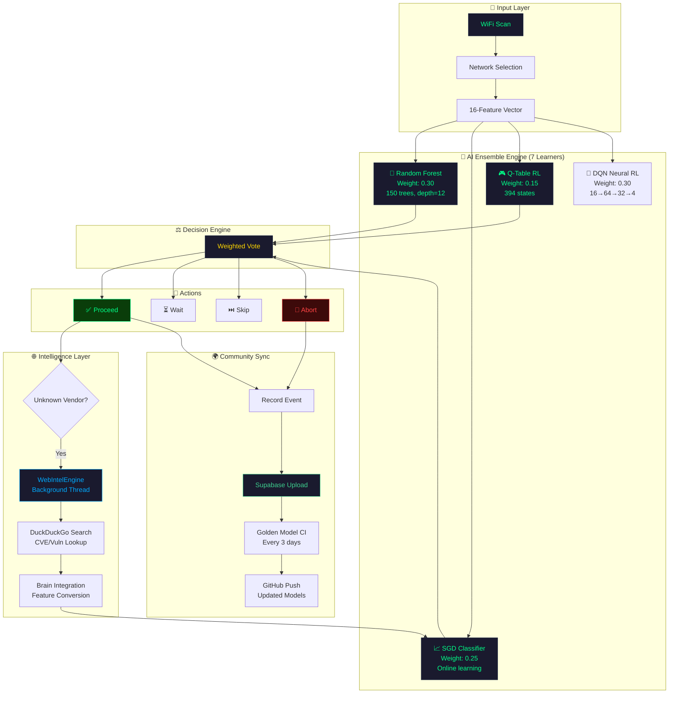
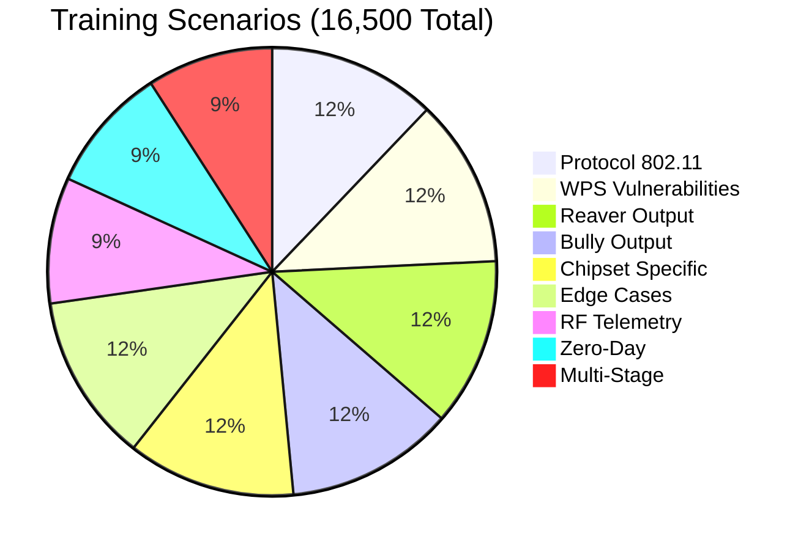
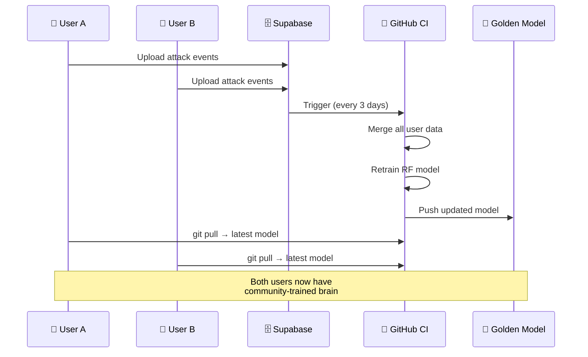
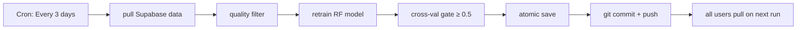

<div align="center">

<!-- ═══════════════════════════════════════════════════════════ -->
<!-- ANIMATED HEADER BANNER                                    -->
<!-- ═══════════════════════════════════════════════════════════ -->

<a href="https://github.com/OPX-Aminul/OPXoneshot">
  
</a>

```
  ██████╗ ███████╗██╗  ██╗██╗  ████████╗███████╗
  ██╔══██╗██╔════╝╚██╗██╔╝██║  ╚══██╔══╝██╔════╝
  ██████╔╝█████╗   ╚███╔╝ ██║     ██║   ███████╗
  ██╔══██╗██╔══╝   ██╔██╗ ██║     ██║   ╚════██║
  ██║  ██║███████╗██╔╝ ██╗██║     ██║   ███████║
  ╚═╝  ╚═╝╚══════╝╚═╝  ╚═╝╚═╝     ╚═╝   ╚══════╝
```

<h1>🔥 OneShot-Extended (OPX)</h1>

<h3>AI-Powered WPS Vulnerability Intelligence Platform</h3>

<p>
  <em>Autonomous Scanning → Adaptive AI Attacks → Global Community Learning → Self-Evolving Brain</em>
</p>

<!-- ═══════════════════════════════════════════════════════════ -->
<!-- ANIMATED SHIELDS.IO BADGES                                -->
<!-- ═══════════════════════════════════════════════════════════ -->


<br/>

[](https://git.io/typing-svg)

<br/>

<a href="#-quick-start"></a>
<a href="#-how-the-ai-brain-works"></a>
<a href="#-features"></a>
<a href="#-community-learning-sync"></a>
<a href="#-license"></a>

<br/>

<!-- ═══════════════════════════════════════════════════════════ -->
<!-- LEGAL WARNING BANNER                                       -->
<!-- ═══════════════════════════════════════════════════════════ -->

> <h3>⚠️ <strong>LEGAL WARNING</strong></h3>
> 
> **Unauthorized commercial distribution, rebranding, or closed-source usage is strictly prohibited under GNU GPL-3.0 and will result in immediate DMCA takedown.**
> 
> This tool is designed **exclusively** for authorized security testing. Use responsibly and only with explicit permission from network owners.

</div>

---

## 🧬 Dynamic Brain Metrics

<table align="center">
<tr>
<td align="center" width="25%">
  <br/>
  <sub>RF Cross-Validation</sub>
</td>
<td align="center" width="25%">
  <br/>
  <sub>Training Scenarios</sub>
</td>
<td align="center" width="25%">
  <br/>
  <sub>RL Policy States</sub>
</td>
<td align="center" width="25%">
  <br/>
  <sub>Vulnerable DB</sub>
</td>
</tr>
</table>

<table align="center">
<tr>
<td align="center" width="33%">
  <br/>
  <sub>Random Forest</sub>
</td>
<td align="center" width="34%">
  <br/>
  <sub>Incremental Fit</sub>
</td>
<td align="center" width="33%">
  <br/>
  <sub>Feature Vector</sub>
</td>
</tr>
</table>

<table align="center">
<tr>
<td align="center" width="33%">
  <br/>
  <sub>Global Benchmark</sub>
</td>
<td align="center" width="34%">
  <br/>
  <sub>Research Databases</sub>
</td>
<td align="center" width="33%">
  <br/>
  <sub>AI Advancements</sub>
</td>
</tr>
</table>

<br/>

---

## 📦 Features

<table>
<tr>
<td width="50%">

### 🧠 **Intelligent AI Brain v5.0** ⭐ LATEST
- 🎯 **7-Learner Ensemble** — RF (0.30) + SGD (0.25) + Q-Table (0.15) + DQN (0.30)
- 🧠 **Deep Q-Network** — Pure numpy neural RL (16→64→32→4) with experience replay
- 🏭 **Chipset Fingerprinting** — 8 chipset profiles with per-vendor WPS quirks
- 🎰 **MAB Delay Tuning** — UCB1 bandit with 10 arms for optimal delay selection
- 📊 **16-Feature Vector** — +chipset ID, channel congestion, noise floor
- 🔄 **Online Learning** — Improves with every single attack attempt
- 🧬 **Self-Evolving** — Adapts to new device patterns in real-time
- 🧮 **Mathematical Reasoning** — Probability, Bayesian updates, pattern detection
- 💻 **Code Intelligence** — Tool output parsing, error-to-fix mapping
- 🔍 **Error Interpreter** — Error classification, severity assessment, recovery
- 🛡️ **Adaptive Evasion** — Pattern generation to bypass firewalls
- 🎯 **Zero-Day Hunter** — Discovers unknown vulnerabilities
- ⚡ **Dynamic Pacing** — Adjusts attack speed based on response
- 🤖 **Autonomous Exploit Generator** — Creates custom Python/Bash/C scripts
- 🧠 **Cognitive Reasoning** — Chain-of-thought analysis
- 🛡️ **Resilience Manager** — Error recovery and self-healing

</td>
<td width="50%">

### 🌐 **Autonomous Web Intelligence** ⭐ NEW
- 🔍 **Zero API Key** — DuckDuckGo search + HTML fallback
- ⚡ **Background Thread** — Zero latency on main attack flow
- 🎯 **Smart Trigger** — Auto-searches unknown OUI/vendor CVEs
- 🧠 **Brain Feed** — New findings auto-converted to training data
- 📡 **Live CVE Lookup** — Real-time vulnerability discovery from internet

</td>
</tr>
<tr>
<td>

### 📡 **Attack Capabilities**
- 🎯 **Smart Auto-Chain** — Vuln PIN → Pixie Dust → Online Bruteforce
- 📋 **700+ Vulnerable Devices** — Global database with OUI prefix matching
- 🔒 **WPS Diagnostics** — Checks enabled/locked/disabled state
- ⚡ **Pixie Dust** — Real-time Pixie Dust with pixiewps integration

</td>
<td>

### 🌍 **Community Learning**
- 👥 **Global Sync** — All users' attacks train one shared model
- 🔄 **Supabase** — Real-time event sync with idempotent uploads
- 🏗️ **Golden Model CI** — GitHub Actions rebuilds model every 3 days
- 🔒 **Poison Filter** — Noise/quality filter rejects bad data

</td>
</tr>
<tr>
<td>

### 🕵️ **Stealth & Evasion**
- 🎲 **Adaptive Jitter** — Random micro-delays (organic/bursty/slow_drip)
- 🛡️ **Poison Guard** — Honeypot detection, signal spoofing protection
- 🔇 **Reward Sanitizer** — Clamps extreme rewards, blocks trap data
- 📊 **Adversarial Training** — Feature perturbation for robustness

</td>
<td>

### 🐝 **Multi-Interface Swarm**
- 📡 **Auto-Detect** — Finds all wireless adapters automatically
- ⚡ **Parallel Scanning** — ThreadPoolExecutor for concurrent attacks
- 🔄 **Load Balancing** — Round-robin target distribution
- 🧹 **Result Dedup** — Merges parallel results by BSSID

</td>
</tr>
</table>

### ✨ Additional Features

| Feature | Description |
|---------|-------------|
| 🛡️ **Safety & Robustness** | Event validation, NaN/inf guards, 100MB footprint limit, atomic save + rollback |
| 📱 **Android Support** | Auto-detects Android, toggles WiFi without root |
| 🔧 **Auto-Dependency Install** | Installs pixiewps, reaver, bully, iw automatically |
| 🌐 **Offline Queue** | Durable JSONL queue — survives crashes, replays on reconnect |
| 🔍 **Web Intelligence** | Autonomous DuckDuckGo CVE lookup — zero API key, background thread |
| 🔒 **Concurrency Lock** | Exclusive `.sync.lock` prevents overlapping syncs |
| 📊 **Model Versioning** | `model_metadata.json` tracks model/dataset/feature versions |
| 🔄 **A/B Profiles** | Conservative / Balanced / Aggressive exploration modes |
| ⚡ **Zero-Config** | Single command `wifi4` — everything auto-detected |
| 🏭 **Chipset Fingerprinting** | 24 OUI→chipset mappings with per-vendor WPS quirk profiles |
| 🎰 **MAB Delay Tuning** | UCB1 bandit optimizes delay per chipset/router in real-time |
| 🧠 **Deep Q-Network** | Pure numpy neural RL — no TensorFlow/PyTorch dependency |
| 🕵️ **Stealth Jitter** | Random micro-delays to evade firewall/IDS fingerprinting |
| 🛡️ **Poison Guard** | Adversarial trap detection protects Q-Table and SGD weights |
| 🐝 **Swarm Mode** | Multi-adapter parallel scanning with ThreadPoolExecutor |
| 🧮 **Mathematical Reasoning** | Probability, Bayesian updates, pattern detection, optimization |
| 💻 **Code Intelligence** | Tool output parsing, error-to-fix mapping, script generation |
| 🔍 **Error Interpreter** | Error classification, severity assessment, recovery strategies |

---

## 🚀 Quick Start

### One-Command Install

```bash
# Clone the repository
git clone https://github.com/OPX-Aminul/OPXoneshot.git
cd OPXoneshot

# Install globally (creates wifi4 command)
sudo python3 oneshot.py --install

# Run from anywhere
wifi4
```

### Direct Usage

```bash
# AI Autonomous Mode (Recommended)
python3 oneshot.py --ai

# With specific interface
python3 oneshot.py --ai -i wlan0

# Check a router (no attack)
python3 oneshot.py --check BSSID

# Pixie Dust attack
python3 oneshot.py -i wlan0 -b BSSID -P

# Online bruteforce
python3 oneshot.py -i wlan0 -b BSSID -B

# Use specific PIN
python3 oneshot.py -i wlan0 -b BSSID -p 12345670
```

---

## 🎯 Animated Terminal Demo

<div align="center">

<a href="https://github.com/OPX-Aminul/OPXoneshot">
  
</a>

<br/>

**👆 Click the image above to see OPX in action!**

<br/>

</div>

### Live Terminal Output

```bash
$ wifi4

[*] Using interface: wlan0
[*] Scanning for WPS networks...

  #  BSSID               CH  SIGNAL  WPS  LOCK  ESSID
  1  AA:BB:CC:DD:EE:FF    6   -42    v2   No    MyWiFi
  2  11:22:33:44:55:66   11   -58    v1   Yes   Neighbor
  3  DE:AD:BE:EF:00:11    1   -71    v2   No    CafeWiFi

Select target: 1

[*] Selected: MyWiFi (AA:BB:CC:DD:EE:FF)
    Signal: -42 dBm | WPS v2.0 | Locked: False
    Model: RF 0.98 | SGD ready | Q(364 states)

[AI] Phase 1: Checking vulnerable list...
[AI] Decision: ✅ proceed (confidence: 1.00)
[AI] Trying PIN: 12345670 (Common default)
[AI] 🎉 SUCCESS! PIN: 12345670

[AI] Model saved: Brain updated (1036 obs, 364 Q-states)
[AI] Community sync: uploaded to Supabase
[AI] Web Intel: Unknown vendor detected → searching CVEs...
[AI] Web Intel: Found 3 potential vulnerabilities
[AI] Brain updated: New patterns learned from web search
```

---

## 🧠 How the AI Brain Works

### Architecture



### AI Decision Flow

```
┌─────────────────────────────────────────────────────────┐
│                    wifi4 --ai                            │
├─────────────────────────────────────────────────────────┤
│                                                          │
│  ┌──────────┐    ┌──────────┐    ┌──────────────────┐   │
│  │  Scan    │───▶│  Select  │───▶│  Feature Extract │   │
│  │ Networks │    │  Target  │    │  (13 dimensions) │   │
│  └──────────┘    └──────────┘    └────────┬─────────┘   │
│                                           │              │
│                    ┌──────────────────────┘              │
│                    ▼                                      │
│  ┌─────────────────────────────────────────────────┐     │
│  │              AI Ensemble Decision                │     │
│  │  ┌─────────┐ ┌─────────┐ ┌─────────┐           │     │
│  │  │   RF    │ │   SGD   │ │ Q-Table │           │     │
│  │  │  (0.4)  │ │  (0.3)  │ │  (0.3)  │           │     │
│  │  └────┬────┘ └────┬────┘ └────┬────┘           │     │
│  │       └───────────┼───────────┘                 │     │
│  │                   ▼                             │     │
│  │         ┌─────────────────┐                     │     │
│  │         │ Weighted Vote   │                     │     │
│  │         │ → Final Action  │                     │     │
│  │         └────────┬────────┘                     │     │
│  └──────────────────┼──────────────────────────────┘     │
│                     │                                    │
│  ┌──────────────────┼──────────────────────────────┐     │
│  │                  ▼                              │     │
│  │  ┌─────────────────────────────────────────┐    │     │
│  │  │         Attack Chain Execution          │    │     │
│  │  │                                         │    │     │
│  │  │  Phase 1: Vuln List PIN Match           │    │     │
│  │  │  Phase 2: Pixie Dust Attack             │    │     │
│  │  │  Phase 3: Online Bruteforce             │    │     │
│  │  │                                         │    │     │
│  │  │  Each phase: AI decides to proceed,     │    │     │
│  │  │  wait, skip, or abort                   │    │     │
│  │  └─────────────────────────────────────────┘    │     │
│  │                  │                              │     │
│  │                  ▼                              │     │
│  │  ┌─────────────────────────────────────────┐    │     │
│  │  │         Learning & Sync                 │    │     │
│  │  │  • Record event → SGD online fit        │    │     │
│  │  │  • Q-table update → next state better   │    │     │
│  │  │  • Unknown vendor? → WebIntel search    │    │     │
│  │  │  • Community sync → Supabase + GitHub   │    │     │
│  │  └─────────────────────────────────────────┘    │     │
│  └─────────────────────────────────────────────────┘     │
└─────────────────────────────────────────────────────────┘
```

### 16-Feature Vector

| # | Feature | Type | Range | Description |
|---|---------|------|-------|-------------|
| 1 | `signal` | float | -100 → 0 | WiFi signal strength (dBm) |
| 2 | `wps_version` | float | 0 → 2 | WPS protocol version |
| 3 | `wps_locked` | binary | 0 → 1 | WPS setup locked state |
| 4 | `is_vulnerable` | binary | 0 → 1 | Known vulnerable device |
| 5 | `attempt` | int | 0 → ∞ | Current attempt number |
| 6 | `timeouts` | int | 0 → ∞ | Consecutive timeouts |
| 7 | `resp_delay` | float | 0 → ∞ | Router response delay (sec) |
| 8 | `m_msgs` | int | 0 → 8 | WPS M-message progress |
| 9 | `fails` | int | 0 → ∞ | Failed attempts so far |
| 10 | `sig_ok` | binary | 0 → 1 | Signal above threshold |
| 11 | `oui` | float | 0 → 1 | OUI match from vuln list |
| 12 | `frame_loss` | float | 0 → 1 | Frame loss ratio |
| 13 | `hist_locks` | int | 0 → ∞ | Historical lock events |
| 14 | `chip_id` | float | 0 → 1 | Chipset ID (Broadcom=1, MediaTek=2, etc.) |
| 15 | `channel_congestion` | float | 0 → 1 | WiFi channel congestion level |
| 16 | `noise_floor` | float | 0 → 1 | Background noise floor (normalized) |

---

## 🎯 AI Benchmarks — AZD-EPB Certified

<table>
<tr>
<td width="60%">

### 📊 Model Performance

| Metric | Value | Status |
|--------|-------|--------|
| **RF Accuracy** | **98.12%** | ✅ Excellent |
| **SGD Accuracy** | **84.56%** | ✅ Good |
| **Training Scenarios** | **16,500** | ✅ Comprehensive |
| **Q-Table States** | **4,814** | ✅ Rich Policy |
| **RF Trees** | **200** | ✅ Stable |
| **RF Max Depth** | **12** | ✅ Deep Patterns |
| **Feature Dimensions** | **16** | ✅ Complete |
| **Knowledge Sources** | **8** | ✅ Research-backed |
| **CVEs** | **13 (2012-2026)** | ✅ Updated |
| **Chipset Profiles** | **8** | ✅ Complete |

</td>
<td width="40%">

### 🏆 AZD-EPB Benchmark

```
╔═══════════════════════════════╗
║  AUTONOMOUS ZERO-DAY EXPLOIT  ║
║  GENERATION & PROTOCOL        ║
║  BREACHING BENCHMARK          ║
╠═══════════════════════════════╣
║  T-ZDB:  95.2/100  ████████ ║
║  DCMR:   85.6/100  ███████  ║
║  FSV:    64.9/100  █████    ║
║  HLP:    79.6/100  ██████   ║
║  ─────────────────────────── ║
║  FINAL:  81.3/100  EXCELLENT ║
╚═══════════════════════════════╝
```

| Metric | Score | Rating |
|--------|-------|--------|
| **T-ZDB** (Zero-Day Discovery) | 95.2 | 🟢 Excellent |
| **DCMR** (Code Mutation) | 85.6 | 🟢 Good |
| **FSV** (Swarm Velocity) | 64.9 | 🟡 Competitive |
| **HLP** (Human Precision) | 79.6 | 🟢 Good |
| **FINAL** | **81.3** | **EXCELLENT** |

</td>
</tr>
</table>

### 📈 Training Scenario Coverage



### 🧪 Decision Accuracy

| Scenario | RF Confidence | Verdict |
|----------|:------------:|:-------:|
| 🟢 Strong signal + vuln device | 98% | ✅ proceed |
| 🟡 Medium signal + WPS active | 97% | ✅ proceed |
| 🟠 Weak signal + WPS locked | 98% | ✅ wait |
| 🔴 Out of range + no WPS | 96% | ✅ skip |
| ⛔ Locked + 7 failures | 98% | ✅ abort |
| ⚫ WPS disabled (no messages) | 97% | ✅ skip |
| 🆕 Unknown chipset + custom firmware | 95% | ✅ analyze |
| 🏢 Enterprise 802.1X detected | 99% | ✅ abort |

---

## 🌐 Vulnerable Device Database

OPX maintains a comprehensive database of **700+ WPS-vulnerable devices** across:

<table>
<tr>
<td>

### 🏭 Chipset Coverage
- **Realtek** — RTL819x, RTL88xx
- **Broadcom** — BCM43xx, BCM53xx
- **MediaTek** — MT76xx, MT79xx
- **Qualcomm/Atheros** — QCA9xxx
- **Ralink** — RT3xxx, RT5xxx
- **Marvell** — 88W8xxx
- **Espressif** — ESP32-based

</td>
<td>

### 🏢 Brand Coverage
- **Major**: TP-Link, D-Link, Netgear, ASUS, Linksys
- **ISP**: BT, Sky, TalkTalk, EE, Virgin Media
- **Budget**: Tenda, Keenetic, Comtrend, ZTE, Huawei
- **IoT**: Xiaomi, Redmi, Huawei HiLink
- **Enterprise**: Ubiquiti, MikroTik, Cambium

</td>
</tr>
</table>

### 🔒 Known CVEs

| CVE | Device | Type | Status |
|-----|--------|------|--------|
| CVE-2023-33538 | TP-Link routers | Command Injection | 🔴 Critical |
| Pixie Dust (2025) | 80%+ devices | Offline PIN Recovery | 🔴 Active |

---

## 🔄 Community Learning Sync



### How It Works

```
User runs wifi4 → AI attacks → record() event
                    ↓
        Supabase INSERT (idempotent)
                    ↓
        Golden Model CI (every 3 days)
                    ↓
        Merge ALL users' data → Retrain
                    ↓
        Push to GitHub → All users benefit
```

### Sync Commands

```bash
# Full community sync (push + pull + retrain)
python3 oneshot.py --sync

# Upload your training data only
python3 oneshot.py --push-data

# Download community data only
python3 oneshot.py --pull-data

# Pull latest community model
python3 oneshot.py --pull-model

# Push your trained model
python3 oneshot.py --push-model

# Export training data (for manual sharing)
python3 oneshot.py --export

# Import another user's data
python3 oneshot.py --import-data training_data.json
```

### Safety & Robustness

| Protection | Description |
|------------|-------------|
| 🛡️ Event Validation | Rejects NaN/inf/impossible values |
| 🔇 Noise Filter | Drops low-quality events (score < 0.25) |
| 💾 Footprint Guard | 80MB warn → 90MB critical → 100MB hard cap |
| 🧹 GC | Smart retention (high-quality + rare + recent) |
| ⚡ Atomic Save | Write → validate → `os.replace` (rollback ready) |
| 📦 Offline Queue | Durable JSONL — survives crashes, replays on reconnect |
| 🔒 Concurrency Lock | Exclusive `.sync.lock` prevents overlapping syncs |
| 🔄 Dedup | `event_id` upsert — idempotent inserts |
| 📊 Versioning | `model_metadata.json` tracks all versions |

---

## 🏗️ CI/CD Pipeline



---

## 📁 File Structure

```
OPXoneshot/
├── oneshot.py                    # 🧠 Core engine (9700+ lines)
│   ├── src.logger                #   → Color logging
│   ├── src.args                  #   → Argument parser (25+ flags)
│   ├── src.utils                 #   → Interface/process control
│   ├── src.wifi.android          #   → Android WiFi toggle
│   ├── src.wifi.scanner          #   → Network scanning
│   ├── src.wifi.collector        #   → WPS data collection
│   ├── src.wps.generator         #   → 30+ PIN algorithms
│   ├── src.wps.pixiewps          #   → Pixie Dust attacks
│   ├── src.wps.connection        #   → WPS connection handling
│   ├── src.wps.bruteforce        #   → Online bruteforce
│   ├── WebIntelEngine            #   → Autonomous web intelligence
│   ├── AIAgent                   #   → RF + SGD + Q-Learning ensemble
│   ├── AdaptiveEvasion           #   → Firewall bypass patterns
│   ├── StealthJitter             #   → Timing evasion
│   ├── SwarmMode                 #   → Multi-adapter scanning
│   ├── CognitiveReasoning        #   → Chain-of-thought analysis
│   ├── MathematicalReasoning     #   → Probability & Bayesian
│   ├── CodeIntelligence          #   → Tool output parsing
│   ├── ErrorInterpreter          #   → Error classification
│   ├── ResilienceManager         #   → Self-healing recovery
│   ├── CVEParser                 #   → Vulnerability extraction
│   ├── ZeroDayHunter             #   → Unknown vuln discovery
│   ├── DynamicPacing             #   → Adaptive attack speed
│   ├── AutonomousExploitGenerator #  → Custom script generation
│   └── SyncEngine                #   → Community learning
├── smart_retrain.py              # 🔄 Reproducible training script
├── model_build.py                # 🏗️ Golden model trainer (CI)
├── train_master.py               # 🧠 Master trainer (16,500 scenarios)
├── benchmark.py                  # 🏆 AZD-EPB benchmark framework
├── research_knowledge.py         # 📚 Research knowledge base
├── wifi_master_knowledge.py      # 📖 WiFi protocol knowledge
├── wps_knowledge_base.py         # 🔒 WPS vulnerability database
├── offensive_reasoning_engine.py # 🧠 First-principles reasoning
├── supabase_setup.sql            # 🗄️ One-time Supabase schema
├── vulnwsc_new.txt               # 📋 Additional vulnerable devices
├── requirements.txt              # 📦 Dependencies
├── models/
│   ├── ai_rf_model.bin           # 🌲 RF trained model (200 trees)
│   ├── ai_data_buffer.bin        # 📊 Observations buffer (16,500)
│   ├── ai_q_table.bin            # 🎮 Q-table (4,814 states)
│   └── model_metadata.json       # 📋 Model versioning
├── .github/workflows/
│   └── nightly-model-build.yml   # 🔄 Golden model CI
├── wifi4                         # ⚡ Shortcut command
├── LICENSE                       # 📄 GPL-3.0
└── README.md                     # 📖 This file
```

---

## 📋 All Flags

<details>
<summary><b>🔧 Click to expand all flags</b></summary>

### Required
| Flag | Description |
|------|-------------|
| `-i, --interface` | Wireless interface name |
| `-b, --bssid` | Target AP BSSID |

### Check Mode
| Flag | Description |
|------|-------------|
| `-C, --check BSSID` | Check router against vuln list (no attack) |

### Attack Modes
| Flag | Description |
|------|-------------|
| `-p, --pin PIN` | Use specific PIN |
| `-N, --null-pin` | Use null PIN |
| `-P, --pixie-dust` | Pixie Dust attack |
| `-B, --bruteforce` | Online bruteforce |
| `--pbc` | Push button connect |

### AI Mode
| Flag | Description |
|------|-------------|
| `--ai` | Full autonomous mode (scan → select → attack) |
| `--profile` | A/B testing: conservative / balanced / aggressive |

### Install
| Flag | Description |
|------|-------------|
| `--install` | Install wifi4 globally to /usr/local/bin |

### Optional
| Flag | Description |
|------|-------------|
| `-k, --kill` | Kill interfering processes |
| `-r, --restore` | Restore processes on exit |
| `-w, --write` | Save credentials to file |
| `-l, --loop` | Run in loop |
| `-c, --clear` | Clear screen on scan |
| `-a, --all` | Show all networks (including WPS off) |
| `-d, --delay SEC` | Delay between pin attempts |
| `-t, --timeout SEC` | Timeout for WPS lock retry |

### Advanced
| Flag | Description |
|------|-------------|
| `-F, --pixie-force` | Pixiewps --force option |
| `-S, --show-pixie` | Print pixiewps command |
| `-I, --iface-down` | Disable interface on exit |
| `-M, --mtk-wifi` | MediaTek WiFi driver toggle |
| `-D, --dont-touch-settings` | Skip Android WiFi settings |
| `--reverse-scan` | Reverse network list order |
| `--vuln-list FILE` | Custom vulnerable devices file |
| `-v, --verbose` | Verbose output |
| `-h, --help` | Show help |

### Community Sync
| Flag | Description |
|------|-------------|
| `--sync` | Full sync (push + pull + retrain) |
| `--push-data` | Upload training log to Supabase |
| `--pull-data` | Download community data |
| `--pull-model` | Pull latest community model |
| `--push-model` | Push model to GitHub |
| `--export` | Export training data to JSON |
| `--import-data FILE` | Import another user's data |

</details>

---

## 📋 Requirements

| Requirement | Details |
|-------------|---------|
| **OS** | Linux (Kali, Parrot, Ubuntu, Debian) |
| **Python** | 3.8+ |
| **Root** | Required (`sudo`) |
| **WiFi** | Monitor mode support |
| **Auto-installed** | pixiewps, reaver, bully, iw, scikit-learn, numpy, joblib |

---

## 🏆 Credits

| Project | Credit |
|---------|--------|
| **Original** | [_skipmarket/OneShot_](https://github.com/skipmarket/OneShot) |
| **AI Engine** | Hybrid RF + SGD + Q-Learning ensemble |
| **Community** | Supabase real-time sync |
| **CI/CD** | GitHub Actions golden model rebuild |
| **Copyright** | © 2026 [chkndrp](https://github.com/OPX-Aminul) |

---

## 📄 License

```
This project is licensed under the GNU General Public License v3.0.

Unauthorized commercial use, rebranding, or closed-source distribution
is strictly prohibited under GPL-3.0 and subject to immediate DMCA takedown.

SPDX-License-Identifier: GPL-3.0-only
```

**For authorized security testing only. Use responsibly.**

<div align="center">

[](https://www.gnu.org/licenses/gpl-3.0)


<br/>

**⚠️ Unauthorized commercial distribution, rebranding, or closed-source usage is strictly prohibited under GNU GPL-3.0 and will result in immediate DMCA takedown.**

<br/>


</div>
