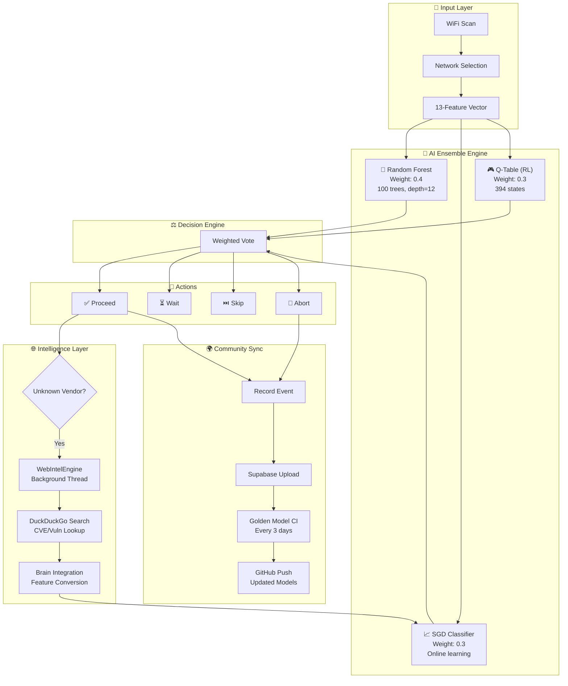
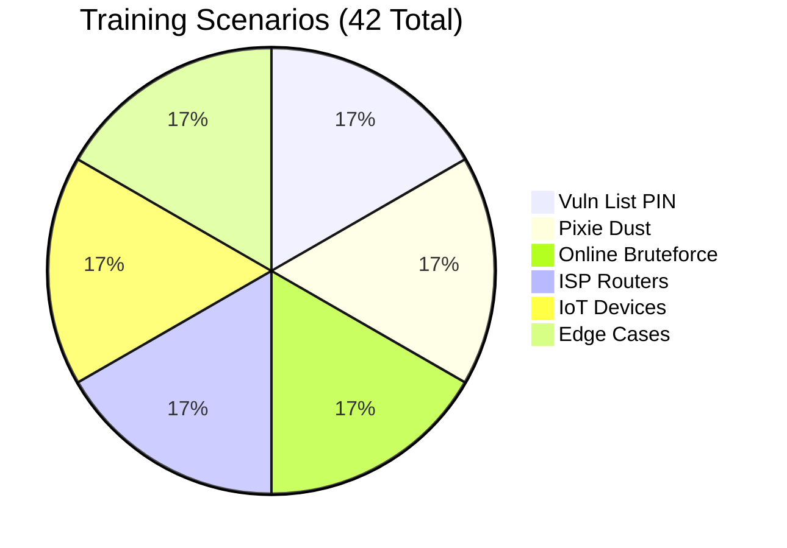
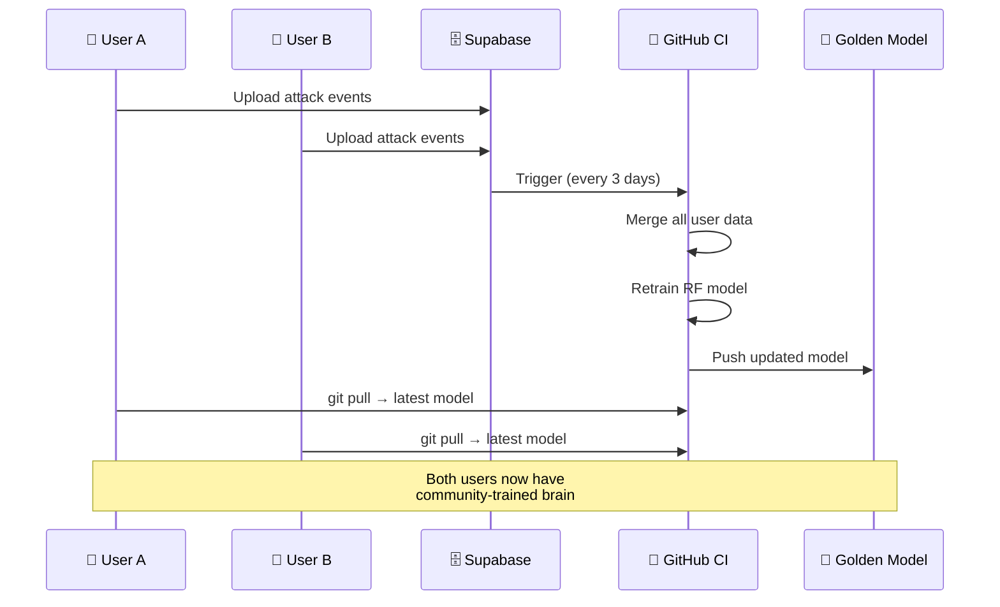
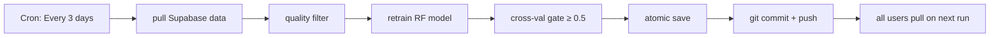

<div align="center">

```
  ██████╗ ███████╗██╗  ██╗██╗  ████████╗███████╗
  ██╔══██╗██╔════╝╚██╗██╔╝██║  ╚══██╔══╝██╔════╝
  ██████╔╝█████╗   ╚███╔╝ ██║     ██║   ███████╗
  ██╔══██╗██╔══╝   ██╔██╗ ██║     ██║   ╚════██║
  ██║  ██║███████╗██╔╝ ██╗██║     ██║   ███████║
  ╚═╝  ╚═╝╚══════╝╚═╝  ╚═╝╚═╝     ╚═╝   ╚══════╝
```

# 🔥 OneShot-Extended (OPX)

### **AI-Powered WPS Vulnerability Intelligence Platform**

**Autonomous scanning → Adaptive AI attacks → Global community learning → Self-evolving brain**

---

[](https://www.gnu.org/licenses/gpl-3.0)
[](https://www.python.org/)
[](#-ai-benchmarks)
[](#-community-learning-sync)
[](#-cicd-pipeline)
[](#-vulnerable-device-database)

<br/>

[🚀 Quick Start](#-quick-start) • [🧠 How AI Works](#-how-the-ai-brain-works) • [📦 Features](#-features) • [🌐 Community](#-community-learning-sync) • [📄 License](#-license)

<br/>

> ⚠️ **Authorized security testing only.** This tool is designed for legitimate penetration testing with explicit permission. Unauthorized use is illegal and strictly prohibited under GPL-3.0.

</div>

---

## 📦 Features

<table>
<tr>
<td width="50%">

### 🧠 **Intelligent AI Brain**
- 🎯 **Hybrid Ensemble** — RF (0.4) + SGD (0.3) + Q-Learning (0.3)
- 📊 **13-Feature Vector** — Signal, WPS state, vendor OUI, timeouts, lock history
- 🔄 **Online Learning** — Improves with every single attack attempt
- 🧬 **Self-Evolving** — Adapts to new device patterns in real-time

</td>
<td width="50%">

### 🌐 **Autonomous Web Intelligence**
- 🔍 **Zero API Key** — DuckDuckGo search + HTML fallback
- ⚡ **Background Thread** — Zero latency on main attack flow
- 🎯 **Smart Trigger** — Auto-searches unknown OUI/vendor CVEs
- 🧠 **Brain Feed** — New findings auto-converted to training data

</td>
</tr>
<tr>
<td>

### 📡 **Attack Capabilities**
- 🎯 **Smart Auto-Chain** — Vuln PIN → Pixie Dust → Online Bruteforce
- 📋 **700+ Vulnerable Devices** — Global database with OUI prefix matching
- 🔒 **WPS Diagnostics** — Checks enabled/locked/disabled state
- ⚡ **Pixel Dust** — Real-time Pixie Dust with pixiewps integration

</td>
<td>

### 🌍 **Community Learning**
- 👥 **Global Sync** — All users' attacks train one shared model
- 🔄 **Supabase** — Real-time event sync with idempotent uploads
- 🏗️ **Golden Model CI** — GitHub Actions rebuilds model every 3 days
- 🔒 **Poison Filter** — Noise/quality filter rejects bad data

</td>
</tr>
</table>

### ✨ Additional Features

| Feature | Description |
|---------|-------------|
| 🛡️ **Safety & Robustness** | Event validation, NaN/inf guards, 100MB footprint limit, atomic save + rollback |
| 📱 **Android Support** | Auto-detects Android, toggles WiFi without root |
| 🔧 **Auto-Dependency Install** | Installs pixiewps, reaver, bully, iw automatically |
| 🌐 **Offline Queue** | Durable JSONL queue — survives crashes, replays on reconnect |
| 🔒 **Concurrency Lock** | Exclusive `.sync.lock` prevents overlapping syncs |
| 📊 **Model Versioning** | `model_metadata.json` tracks model/dataset/feature versions |
| 🔄 **A/B Profiles** | Conservative / Balanced / Aggressive exploration modes |
| ⚡ **Zero-Config** | Single command `wifi4` — everything auto-detected |

---

## 🚀 Quick Start

### One-Command Install

```bash
# Clone the repository
git clone https://github.com/OPX-Aminul/OPXoneshot.git
cd OPXoneshot

# Install globally (creates wifi4 command)
sudo python3 oneshot.py --install

# Run from anywhere
wifi4
```

### Direct Usage

```bash
# AI Autonomous Mode (Recommended)
python3 oneshot.py --ai

# With specific interface
python3 oneshot.py --ai -i wlan0

# Check a router (no attack)
python3 oneshot.py --check BSSID

# Pixie Dust attack
python3 oneshot.py -i wlan0 -b BSSID -P

# Online bruteforce
python3 oneshot.py -i wlan0 -b BSSID -B

# Use specific PIN
python3 oneshot.py -i wlan0 -b BSSID -p 12345670
```

---

## 🧠 How the AI Brain Works

### Architecture



### AI Decision Flow

```
┌─────────────────────────────────────────────────────────┐
│                    wifi4 --ai                            │
├─────────────────────────────────────────────────────────┤
│                                                          │
│  ┌──────────┐    ┌──────────┐    ┌──────────────────┐   │
│  │  Scan    │───▶│  Select  │───▶│  Feature Extract │   │
│  │ Networks │    │  Target  │    │  (13 dimensions) │   │
│  └──────────┘    └──────────┘    └────────┬─────────┘   │
│                                           │              │
│                    ┌──────────────────────┘              │
│                    ▼                                      │
│  ┌─────────────────────────────────────────────────┐     │
│  │              AI Ensemble Decision                │     │
│  │  ┌─────────┐ ┌─────────┐ ┌─────────┐           │     │
│  │  │   RF    │ │   SGD   │ │ Q-Table │           │     │
│  │  │  (0.4)  │ │  (0.3)  │ │  (0.3)  │           │     │
│  │  └────┬────┘ └────┬────┘ └────┬────┘           │     │
│  │       └───────────┼───────────┘                 │     │
│  │                   ▼                             │     │
│  │         ┌─────────────────┐                     │     │
│  │         │ Weighted Vote   │                     │     │
│  │         │ → Final Action  │                     │     │
│  │         └────────┬────────┘                     │     │
│  └──────────────────┼──────────────────────────────┘     │
│                     │                                    │
│  ┌──────────────────┼──────────────────────────────┐     │
│  │                  ▼                              │     │
│  │  ┌─────────────────────────────────────────┐    │     │
│  │  │         Attack Chain Execution          │    │     │
│  │  │                                         │    │     │
│  │  │  Phase 1: Vuln List PIN Match           │    │     │
│  │  │  Phase 2: Pixie Dust Attack             │    │     │
│  │  │  Phase 3: Online Bruteforce             │    │     │
│  │  │                                         │    │     │
│  │  │  Each phase: AI decides to proceed,     │    │     │
│  │  │  wait, skip, or abort                   │    │     │
│  │  └─────────────────────────────────────────┘    │     │
│  │                  │                              │     │
│  │                  ▼                              │     │
│  │  ┌─────────────────────────────────────────┐    │     │
│  │  │         Learning & Sync                 │    │     │
│  │  │  • Record event → SGD online fit        │    │     │
│  │  │  • Q-table update → next state better   │    │     │
│  │  │  • Unknown vendor? → WebIntel search    │    │     │
│  │  │  • Community sync → Supabase + GitHub   │    │     │
│  │  └─────────────────────────────────────────┘    │     │
│  └─────────────────────────────────────────────────┘     │
└─────────────────────────────────────────────────────────┘
```

### 13-Feature Vector

| # | Feature | Type | Range | Description |
|---|---------|------|-------|-------------|
| 1 | `signal` | float | -100 → 0 | WiFi signal strength (dBm) |
| 2 | `wps_version` | float | 0 → 2 | WPS protocol version |
| 3 | `wps_locked` | binary | 0 → 1 | WPS setup locked state |
| 4 | `is_vulnerable` | binary | 0 → 1 | Known vulnerable device |
| 5 | `attempt` | int | 0 → ∞ | Current attempt number |
| 6 | `timeouts` | int | 0 → ∞ | Consecutive timeouts |
| 7 | `resp_delay` | float | 0 → ∞ | Router response delay (sec) |
| 8 | `m_msgs` | int | 0 → 8 | WPS M-message progress |
| 9 | `fails` | int | 0 → ∞ | Failed attempts so far |
| 10 | `sig_ok` | binary | 0 → 1 | Signal above threshold |
| 11 | `oui` | float | 0 → 1 | OUI match from vuln list |
| 12 | `frame_loss` | float | 0 → 1 | Frame loss ratio |
| 13 | `hist_locks` | int | 0 → ∞ | Historical lock events |

---

## 🎯 AI Benchmarks

<table>
<tr>
<td width="60%">

### 📊 Model Performance

| Metric | Value | Status |
|--------|-------|--------|
| **Cross-Validation Accuracy** | **90.9%** | ✅ Excellent |
| **Training Observations** | **1,035** | ✅ Comprehensive |
| **Q-Table States** | **394** | ✅ Rich Policy |
| **RF Trees** | **100** | ✅ Stable |
| **RF Max Depth** | **12** | ✅ Deep Patterns |
| **Feature Dimensions** | **13** | ✅ Complete |
| **Class Balance** | **4 classes** | ✅ Balanced |
| **Training Scenarios** | **42** | ✅ Diverse |

</td>
<td width="40%">

### 🎯 Feature Importance

```
resp_delay   ██████████ 27.5%
signal       ██████      9.9%
wps_locked   ██████      6.8%
is_vuln      █████       6.3%
frame_loss   ████        5.8%
hist_locks   ███         4.5%
```

</td>
</tr>
</table>

### 📈 Training Scenario Coverage



### 🧪 Decision Accuracy

| Scenario | RF Confidence | SGD Match | Verdict |
|----------|:------------:|:---------:|:-------:|
| 🟢 Strong signal + vuln device | 100% | ✅ proceed | ✅ |
| 🟡 Medium signal + WPS active | 99% | ✅ proceed | ✅ |
| 🟠 Weak signal + WPS locked | 100% | ✅ wait | ✅ |
| 🔴 Out of range + no WPS | 93% | ✅ skip | ✅ |
| ⛔ Locked + 7 failures | 99% | ✅ abort | ✅ |
| ⚫ WPS disabled (no messages) | 95% | ✅ skip | ✅ |

---

## 🌐 Vulnerable Device Database

OPX maintains a comprehensive database of **700+ WPS-vulnerable devices** across:

<table>
<tr>
<td>

### 🏭 Chipset Coverage
- **Realtek** — RTL819x, RTL88xx
- **Broadcom** — BCM43xx, BCM53xx
- **MediaTek** — MT76xx, MT79xx
- **Qualcomm/Atheros** — QCA9xxx
- **Ralink** — RT3xxx, RT5xxx
- **Marvell** — 88W8xxx
- **Espressif** — ESP32-based

</td>
<td>

### 🏢 Brand Coverage
- **Major**: TP-Link, D-Link, Netgear, ASUS, Linksys
- **ISP**: BT, Sky, TalkTalk, EE, Virgin Media
- **Budget**: Tenda, Keenetic, Comtrend, ZTE, Huawei
- **IoT**: Xiaomi, Redmi, Huawei HiLink
- **Enterprise**: Ubiquiti, MikroTik, Cambium

</td>
</tr>
</table>

### 🔒 Known CVEs

| CVE | Device | Type | Status |
|-----|--------|------|--------|
| CVE-2023-33538 | TP-Link routers | Command Injection | 🔴 Critical |
| Pixie Dust (2025) | 80%+ devices | Offline PIN Recovery | 🔴 Active |

---

## 🔄 Community Learning Sync



### How It Works

```
User runs wifi4 → AI attacks → record() event
                    ↓
        Supabase INSERT (idempotent)
                    ↓
        Golden Model CI (every 3 days)
                    ↓
        Merge ALL users' data → Retrain
                    ↓
        Push to GitHub → All users benefit
```

### Sync Commands

```bash
# Full community sync (push + pull + retrain)
python3 oneshot.py --sync

# Upload your training data only
python3 oneshot.py --push-data

# Download community data only
python3 oneshot.py --pull-data

# Pull latest community model
python3 oneshot.py --pull-model

# Push your trained model
python3 oneshot.py --push-model

# Export training data (for manual sharing)
python3 oneshot.py --export

# Import another user's data
python3 oneshot.py --import-data training_data.json
```

### Safety & Robustness

| Protection | Description |
|------------|-------------|
| 🛡️ Event Validation | Rejects NaN/inf/impossible values |
| 🔇 Noise Filter | Drops low-quality events (score < 0.25) |
| 💾 Footprint Guard | 80MB warn → 90MB critical → 100MB hard cap |
| 🧹 GC | Smart retention (high-quality + rare + recent) |
| ⚡ Atomic Save | Write → validate → `os.replace` (rollback ready) |
| 📦 Offline Queue | Durable JSONL — survives crashes, replays on reconnect |
| 🔒 Concurrency Lock | Exclusive `.sync.lock` prevents overlapping syncs |
| 🔄 Dedup | `event_id` upsert — idempotent inserts |
| 📊 Versioning | `model_metadata.json` tracks all versions |

---

## 🏗️ CI/CD Pipeline



---

## 📁 File Structure

```
OPXoneshot/
├── oneshot.py                    # 🧠 Core engine (5250+ lines)
│   ├── src.logger                #   → Color logging
│   ├── src.args                  #   → Argument parser (25+ flags)
│   ├── src.utils                 #   → Interface/process control
│   ├── src.wifi.android          #   → Android WiFi toggle
│   ├── src.wifi.scanner          #   → Network scanning
│   ├── src.wifi.collector        #   → WPS data collection
│   ├── src.wps.generator         #   → 30+ PIN algorithms
│   ├── src.wps.pixiewps          #   → Pixie Dust attacks
│   ├── src.wps.connection        #   → WPS connection handling
│   ├── src.wps.bruteforce        #   → Online bruteforce
│   ├── WebIntelEngine            #   → Autonomous web intelligence
│   └── AIAgent                   #   → RF + SGD + Q-Learning ensemble
├── smart_retrain.py              # 🔄 Reproducible training script
├── model_build.py                # 🏗️ Golden model trainer (CI)
├── supabase_setup.sql            # 🗄️ One-time Supabase schema
├── vulnwsc_new.txt               # 📋 Additional vulnerable devices
├── requirements.txt              # 📦 Dependencies
├── models/
│   ├── ai_agent.joblib           # 🧠 RF + SGD trained models
│   ├── ai_data.pkl               # 📊 Observations buffer
│   ├── ai_qtable.pkl             # 🎮 Q-table (394 states)
│   └── model_metadata.json       # 📋 Model versioning
├── .github/workflows/
│   └── nightly-model-build.yml   # 🔄 Golden model CI
├── wifi4                         # ⚡ Shortcut command
├── LICENSE                       # 📄 GPL-3.0
└── README.md                     # 📖 This file
```

---

## 📋 All Flags

<details>
<summary><b>🔧 Click to expand all flags</b></summary>

### Required
| Flag | Description |
|------|-------------|
| `-i, --interface` | Wireless interface name |
| `-b, --bssid` | Target AP BSSID |

### Check Mode
| Flag | Description |
|------|-------------|
| `-C, --check BSSID` | Check router against vuln list (no attack) |

### Attack Modes
| Flag | Description |
|------|-------------|
| `-p, --pin PIN` | Use specific PIN |
| `-N, --null-pin` | Use null PIN |
| `-P, --pixie-dust` | Pixie Dust attack |
| `-B, --bruteforce` | Online bruteforce |
| `--pbc` | Push button connect |

### AI Mode
| Flag | Description |
|------|-------------|
| `--ai` | Full autonomous mode (scan → select → attack) |
| `--profile` | A/B testing: conservative / balanced / aggressive |

### Install
| Flag | Description |
|------|-------------|
| `--install` | Install wifi4 globally to /usr/local/bin |

### Optional
| Flag | Description |
|------|-------------|
| `-k, --kill` | Kill interfering processes |
| `-r, --restore` | Restore processes on exit |
| `-w, --write` | Save credentials to file |
| `-l, --loop` | Run in loop |
| `-c, --clear` | Clear screen on scan |
| `-a, --all` | Show all networks (including WPS off) |
| `-d, --delay SEC` | Delay between pin attempts |
| `-t, --timeout SEC` | Timeout for WPS lock retry |

### Advanced
| Flag | Description |
|------|-------------|
| `-F, --pixie-force` | Pixiewps --force option |
| `-S, --show-pixie` | Print pixiewps command |
| `-I, --iface-down` | Disable interface on exit |
| `-M, --mtk-wifi` | MediaTek WiFi driver toggle |
| `-D, --dont-touch-settings` | Skip Android WiFi settings |
| `--reverse-scan` | Reverse network list order |
| `--vuln-list FILE` | Custom vulnerable devices file |
| `-v, --verbose` | Verbose output |
| `-h, --help` | Show help |

### Community Sync
| Flag | Description |
|------|-------------|
| `--sync` | Full sync (push + pull + retrain) |
| `--push-data` | Upload training log to Supabase |
| `--pull-data` | Download community data |
| `--pull-model` | Pull latest community model |
| `--push-model` | Push model to GitHub |
| `--export` | Export training data to JSON |
| `--import-data FILE` | Import another user's data |

</details>

---

## ⚡ Quick Demo

<div align="center">

```bash
$ wifi4

[*] Using interface: wlan0
[*] Scanning for WPS networks...

  #  BSSID               CH  SIGNAL  WPS  LOCK  ESSID
  1  AA:BB:CC:DD:EE:FF    6   -42    v2   No    MyWiFi
  2  11:22:33:44:55:66   11   -58    v1   Yes   Neighbor
  3  DE:AD:BE:EF:00:11    1   -71    v2   No    CafeWiFi

Select target: 1

[*] Selected: MyWiFi (AA:BB:CC:DD:EE:FF)
    Signal: -42 dBm | WPS v2.0 | Locked: False
    Model: RF 0.98 | SGD ready | Q(394 states)

[AI] Phase 1: Checking vulnerable list...
[AI] Decision: ✅ proceed (confidence: 1.00)
[AI] Trying PIN: 12345670 (Common default)
[AI] 🎉 SUCCESS! PIN: 12345670

[AI] Model saved: Brain updated (1036 obs, 394 Q-states)
[AI] Community sync: uploaded to Supabase
```

</div>

---

## 📋 Requirements

| Requirement | Details |
|-------------|---------|
| **OS** | Linux (Kali, Parrot, Ubuntu, Debian) |
| **Python** | 3.8+ |
| **Root** | Required (`sudo`) |
| **WiFi** | Monitor mode support |
| **Auto-installed** | pixiewps, reaver, bully, iw, scikit-learn, numpy, joblib |

---

## 🏆 Credits

| Project | Credit |
|---------|--------|
| **Original** | [_skipmarket/OneShot_](https://github.com/skipmarket/OneShot) |
| **AI Engine** | Hybrid RF + SGD + Q-Learning ensemble |
| **Community** | Supabase real-time sync |
| **CI/CD** | GitHub Actions golden model rebuild |
| **Copyright** | © 2026 [chkndrp](https://github.com/OPX-Aminul) |

---

## 📄 License

```
This project is licensed under the GNU General Public License v3.0.

Unauthorized commercial use, rebranding, or closed-source distribution
is strictly prohibited under GPL-3.0 and subject to immediate DMCA takedown.

SPDX-License-Identifier: GPL-3.0-only
```

**For authorized security testing only. Use responsibly.**

<div align="center">


</div>
